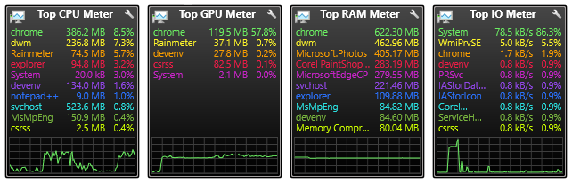

# Top Process Meter
**Top Process Meter Gadgets inspired by the well-known AddGadgets.com Windows Sidebar gadgets.**

The Top Process Meter Gadgets monitor the CPU, GPU, RAM, and I/O utilization of the top 10 processes on your computer, with styling to match the [Gadgets](https://github.com/SilverAzide/Gadgets) suite. For help and more, visit the Top Process Meter on the [Rainmeter Forums](https://forum.rainmeter.net/viewtopic.php?f=27&t=27905).

These gadgets use the UsageMonitor plugin (added in Rainmeter 4.2.0), and as a result do not have the performance problems and functional limitations associated with plugins in earlier versions of Rainmeter. UsageMonitor also is not affected by locale, and will work with any language.

**[Download the latest version here (5.2.0)](https://github.com/SilverAzide/Top-Process-Meter/releases/download/v5.2.0/Top.Process.Meter.-.Gadgets.Patch_5.2.0.rmskin)**

**NOTE:** 
The installer is in the form of a patch, which will patch your existing [Gadgets](https://github.com/SilverAzide/Gadgets) installation without affecting your existing configuration or layouts. If you don't have the Gadgets suite installed, these will install as standalone skins.

## Features
* Displays 1 to 10 top processes, ordered by CPU/GPU/RAM/IO utilization.
* Displays the amount of memory used by each process.
* Displays graph of total CPU/GPU/RAM/IO utilization (optional).
* Shows Resource Monitor when gadget is double-clicked.
* Scales to any desired size.

## Requirements
Rainmeter 4.4.0 or later: <https://www.rainmeter.net>. 
Top GPU Meter requires Windows 10 Fall Creator's Update (v1709) or later.

## Attribution
* [Gadgets](https://github.com/SilverAzide/Gadgets) by [SilverAzide](https://github.com/SilverAzide).

## License
Creative Commons Attribution-Noncommercial-Share Alike 3.0 License
