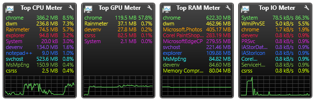

# Top Process Meter
**Top Process Meter Gadgets inspired by the well-known AddGadgets.com Windows Sidebar gadgets.**

---
##### NOTE:
:warning: **Top Process Meter** has been incorporated into the Gadgets suite. [Get the latest Gadgets here](https://github.com/SilverAzide/Gadgets). :warning:

This repository is maintained for users of older versions.

---
The Top Process Meter Gadgets monitor the CPU, GPU, RAM, and I/O utilization of the top 10 processes on your computer, with styling to match the [Gadgets](https://github.com/SilverAzide/Gadgets/#readme) suite.

These gadgets use the UsageMonitor plugin (added in Rainmeter 4.2.0), and as a result do not have the performance problems and functional limitations associated with plugins in earlier versions of Rainmeter. UsageMonitor also is not affected by locale, and will work with any language.

## Features
* Displays 1 to 10 top processes, ordered by CPU/GPU/RAM/IO utilization.
* Displays the amount of memory used by each process.
* Displays graph of total CPU/GPU/RAM/IO utilization (optional).
* Shows Resource Monitor when gadget is double-clicked.
* Scales to any desired size.

## Requirements
Rainmeter 4.4.0 or later: <https://www.rainmeter.net>. 
Top GPU Meter requires Windows 10 Fall Creator's Update (v1709) or later.

## Attribution
* [Gadgets](https://github.com/SilverAzide/Gadgets/#readme) by [SilverAzide](https://github.com/SilverAzide).

## License
Creative Commons Attribution-NonCommercial-ShareAlike 4.0 International (CC BY-NC-SA 4.0)

---

